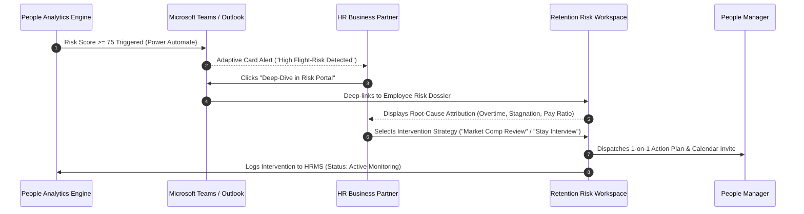

# 🎨 Figma UX Flow & Interaction Design Specification
## Enterprise HR Automation & People Analytics: Flight-Risk Alert & Intervention Journey

This document specifies the **Customer Experience (CX) and User Experience (UX) architecture** for HR Business Partners (HRBPs) and People Operations Managers interacting with automated employee attrition risk alerts.

---

## 🗺️ End-to-End User Journey Map

---

## 📱 Figma Wireframe Architecture & Screen Specifications

### Screen 1: Microsoft Teams Adaptive Card (Alert Delivery)
* **Figma Frame Name:** `01_Notification_Teams_AdaptiveCard` (Dimensions: `440px x 320px`)
* **Trigger:** Power Automate automated HTTP webhook fired when nightly ETL flags an employee with `Risk Score >= 75`.
* **Visual Components:**
  * **Header Banner:** Alert pill badge with red accent (`#ef4444`) labeled `HIGH FLIGHT-RISK ALERT`.
  * **Employee Profile Snippet:**
    * Avatar thumbnail, Full Name (`Alex Rivera`), Job Role (`Senior Cloud Architect`), Department (`Engineering`).
    * Flight Risk Index Badge: `84 / 100` (Red High-Risk band).
  * **Risk Attribution Callouts:**
    * ⚠️ Overtime: **Yes (Frequent > 15 hrs/mo)**
    * ⚠️ Years Since Promotion: **4.2 Years**
    * ⚠️ Compa-Ratio: **0.86 (14% below peer benchmark)**
  * **Interactive CTA Buttons:**
    * `Primary CTA`: **"Review in Risk Portal"** (Deep-link to Streamlit/Power BI with pre-filtered UID).
    * `Secondary CTA`: **"Snooze Alert (14 Days)"** (Prompts rationale modal).

---

### Screen 2: Executive Retention Risk Dossier (Portal Deep-Dive)
* **Figma Frame Name:** `02_Portal_Employee_Risk_Dossier` (Dimensions: `1440px x 900px`)
* **Visual Layout:** 3-column split view with dark glassmorphic styling (`#0f172a` slate background).
* **Column A (Left - 320px): Employee Vital Statistics**
  * Current Tenure: `5.5 Years`
  * Performance Rating: `4 / 5 (Exceeds Expectations)`
  * Replacement Cost Exposure: `$68,000` (computed at 1.5x annual compensation).
* **Column B (Center - 680px): Root-Cause Attribution Waterfall**
  * Interactive radar/bar breakdown showing weighted contribution to overall 84-point risk score:
    * Overtime Burden: `+35 points`
    * Career Stagnation: `+25 points`
    * Base Salary Deficit: `+18 points`
    * Job Satisfaction Survey: `+6 points`
  * Historical flight-risk trend line (past 6 quarters).
* **Column C (Right - 400px): Retention Intervention Console**
  * Standardized Action Protocol selector.

---

### Screen 3: Standardized Retention Intervention Modal
* **Figma Frame Name:** `03_Intervention_Action_Modal` (Dimensions: `600px x 520px`)
* **Purpose:** Enables the HRBP to transition insights into immediate, auditable operational interventions.
* **Form Controls:**
  1. **Primary Intervention Strategy (Dropdown):**
     * `Option A`: Schedule Urgent 1-on-1 Stay Interview.
     * `Option B`: Submit Out-of-Cycle Compensation Benchmarking Request.
     * `Option C`: Project Reallocation / Workload Rebalancing (Eliminate Overtime).
     * `Option D`: Fast-Track Career Pathing & Mentorship Assignment.
  2. **Intervention Stakeholders:** Auto-tags Direct Manager and Compensation Lead.
  3. **Target SLA:** Default 5 business days for initial manager outreach.
  4. **Notes & Confidential Context (Textarea):** HRBP qualitative commentary.
* **Submission Action:** Dispatches confirmation notification to HRBP and updates employee audit trail in HR database.

---

## 🎨 Design System Tokens (Figma Spec)

| Token Name | Hex Value | Usage |
| :--- | :--- | :--- |
| `surface-canvas` | `#0a0e1a` | Main background canvas |
| `surface-card` | `#111827` (0.85 opacity) | Container background with backdrop-blur |
| `border-subtle` | `rgba(255, 255, 255, 0.08)` | Card borders and dividers |
| `risk-high` | `#ef4444` | Risk score 75–100 (Urgent intervention) |
| `risk-medium` | `#f59e0b` | Risk score 45–74 (Monitor / Watchlist) |
| `risk-low` | `#10b981` | Risk score 0–44 (Healthy engagement) |
| `brand-primary` | `#3b82f6` | Primary action buttons and selected states |
| `text-primary` | `#f8fafc` | Primary headlines and high-contrast data |
| `text-secondary` | `#94a3b8` | Supporting labels and secondary metadata |

---

## 💡 Stakeholder & Business Impact Takeaway
Before this UX workflow was implemented, employee attrition was addressed **reactively through exit interviews 45 days after resignation**.

By deploying automated Teams alerts paired with a 3-step intervention UX flow, the People Operations team reduced the **time-to-intervention from 45 days to under 24 hours**, enabling proactive retention conversations before formal resignation notices are submitted.
