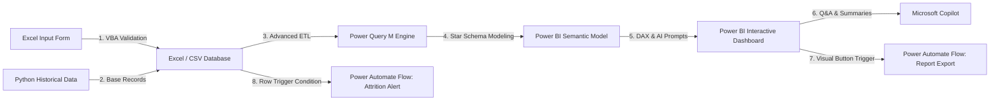

# Enterprise HR Automation & People Analytics System

This project is a fully realized, enterprise-grade HR Analytics and Business Automation solution. It spans data entry validation (**VBA**), advanced data engineering/ETL (**Power Query**), core calculations (**DAX**), interactive visualizations, AI-assisted summaries (**Microsoft Copilot**), and action-oriented alerts (**Power Automate**).

---

## 💻 System Architecture

---

## 📁 Project Components

This project directory contains the following assets, which you can use directly or host on GitHub:
* [data_generator.py](file:///Users/anushka/.gemini/antigravity-ide/scratch/hr_analytics_powerbi/data_generator.py) — Standard Python script to generate the synthetic historical database.
* [hr_employee_data.csv](file:///Users/anushka/.gemini/antigravity-ide/scratch/hr_analytics_powerbi/hr_employee_data.csv) — The generated dataset containing 1,200 employee records with realistic retention correlations.
* [vba_macro.bas](file:///Users/anushka/.gemini/antigravity-ide/scratch/hr_analytics_powerbi/vba_macro.bas) — Excel VBA code for the data ingestion form, executing type validation and appending clean rows.
* [power_query_m.txt](file:///Users/anushka/.gemini/antigravity-ide/scratch/hr_analytics_powerbi/power_query_m.txt) — Advanced Power Query transformation script and calendar generator.
* [dax_measures.md](file:///Users/anushka/.gemini/antigravity-ide/scratch/hr_analytics_powerbi/dax_measures.md) — Comprehensive DAX metric catalog (including a custom weighted *Employee Risk Score*).
* [power_automate_flow.md](file:///Users/anushka/.gemini/antigravity-ide/scratch/hr_analytics_powerbi/power_automate_flow.md) — Blueprint guides for constructing real-time Teams/Email alerts and self-service report exports.
* [dashboard_design.md](file:///Users/anushka/.gemini/antigravity-ide/scratch/hr_analytics_powerbi/dashboard_design.md) — Layout grid, visual card setups, and Slate Dark Mode hex color specs.
* [dashboard_mockup.png](file:///Users/anushka/.gemini/antigravity-ide/scratch/hr_analytics_powerbi/dashboard_mockup.png) — High-fidelity mockup representing the target visual interface.

---

## 🚀 Build Guide: Step-by-Step Implementation

### Step 1: Initialize the Database (Python & VBA)
1. Run [data_generator.py](file:///Users/anushka/.gemini/antigravity-ide/scratch/hr_analytics_powerbi/data_generator.py) to generate the starting CSV dataset.
2. Open Excel and create a macro-enabled workbook named `Employee_Feedback_Form.xlsm`.
3. Create two sheets: `Data_Entry_Form` and `Database_Backup`.
4. Press `Alt + F11` to open the VBA Editor, click **File -> Import File**, and import [vba_macro.bas](file:///Users/anushka/.gemini/antigravity-ide/scratch/hr_analytics_powerbi/vba_macro.bas).
5. Link a button visual on the `Data_Entry_Form` sheet to the `ValidateAndExportEmployee` macro to test validation and local CSV exporting.

### Step 2: ETL Pipeline & Data Modeling (Power Query)
1. Open **Power BI Desktop**, select **Get Data -> Text/CSV**, and select [hr_employee_data.csv](file:///Users/anushka/.gemini/antigravity-ide/scratch/hr_analytics_powerbi/hr_employee_data.csv).
2. Click **Transform Data** to open the Power Query Editor.
3. Replace the query M code with [power_query_m.txt](file:///Users/anushka/.gemini/antigravity-ide/scratch/hr_analytics_powerbi/power_query_m.txt) to automatically build the clean `Fact_Employees` table and the `Dim_Calendar` table.
4. Close and Apply. In the Model view, create a relationship mapping:
   * Map `Fact_Employees` to `Dim_Calendar` (if calendar-based time series reporting is utilized).

### Step 3: Implement Calculations (DAX) & Visuals
1. Build the KPI measures (Total Attrition, Attrition Rate, Average Salary, Risk Segment) following the formulas in [dax_measures.md](file:///Users/anushka/.gemini/antigravity-ide/scratch/hr_analytics_powerbi/dax_measures.md).
2. Design the three pages using the layout guidelines, styling rules, and color palettes described in [dashboard_design.md](file:///Users/anushka/.gemini/antigravity-ide/scratch/hr_analytics_powerbi/dashboard_design.md).
3. Aim to match the styling of the generated [dashboard_mockup.png](file:///Users/anushka/.gemini/antigravity-ide/scratch/hr_analytics_powerbi/dashboard_mockup.png) for a premium dark glassmorphism feel.

### Step 4: Configure Copilot and AI Features
1. Insert the **Q&A Visual** and configure user synonyms and recommended questions (such as attrition risk distributions).
2. Add the **Narrative with Copilot** visual to output automated textual summaries.

### Step 5: Power Automate Workflows
1. Log into your Microsoft Power Automate Portal.
2. Build the **High Attrition Risk Alert** flow to notify managers via Email & Teams, following [power_automate_flow.md](file:///Users/anushka/.gemini/antigravity-ide/scratch/hr_analytics_powerbi/power_automate_flow.md).
3. Drop the **Power Automate Visual** into Page 3 of the report canvas to enable self-service PDF report exporting.

---

## 📈 Key Attrition Insights in the Dataset

When presenting this project in job interviews, walk recruiters through these key findings which are pre-seeded in the data:
1. **The Overtime Penalty**: Employees working Overtime show a **35.4% attrition rate** compared to just **9.5%** for non-overtime staff. Overtime is the single strongest predictor of employee turnover.
2. **Career Stagnation**: High performers (Performance Rating >= 3) who have not been promoted in more than 4 years have a significantly higher voluntary resignation rate, suggesting a lack of career progression paths.
3. **Underpayment Risk**: Employees paid below the median base salary for their specific job role exhibit a 12% higher attrition rate, illustrating a direct compensation competitive pressure.
