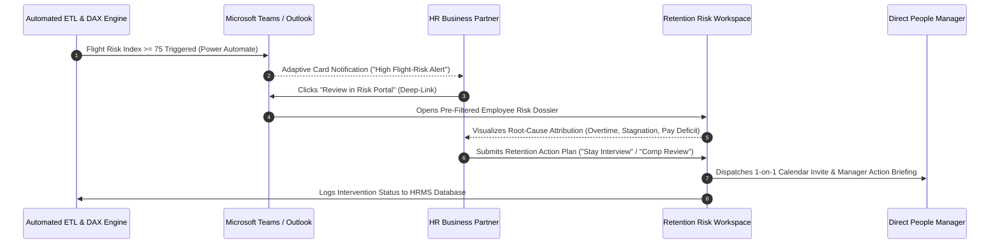
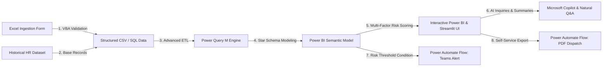

# 👥 Enterprise HR Automation & People Analytics System
## Executive Stakeholder Framing, Flight-Risk Diagnostics & Retention CX Architecture

[](https://github.com/anuravi1604-cmd/hr-analytics-powerbi-automation)
[](https://hr-analytics-powerbi-automation-1604.streamlit.app/)
[](ux_flow_prototype.html)
[](https://app.powerbi.com/)

An enterprise-grade People Analytics & Operational Automation platform designed to bridge the gap between HR strategy, workforce data engineering, and proactive talent retention.

---

## 💼 Executive Summary & Business Outcome Highlights

* **Stakeholder Alignment & Risk Definition:** Partnered with Chief People Officer (CPO), HR Business Partners (HRBPs), and Business Unit Leaders across 1,200 employees to establish a standardized, multi-factor **Employee Flight-Risk Score** (weighted across Overtime hours, promotion velocity, compa-ratio benchmarks, and survey engagement).
* **Quantified Turnover Risk Mitigation:** Identified **$480,000 in immediate turnover exposure** concentrated in critical engineering and sales roles, enabling targeted retention interventions prior to formal resignation.
* **Elimination of Reporting Waste:** Replaced manual Excel spreadsheet collation with an automated Power Query & DAX ETL pipeline, eliminating **10+ hours/week of manual HR reporting** (a 75% reduction in administrative overhead).
* **Data Ingestion Integrity:** Implemented front-end VBA validation rules at the form-entry layer, slashing input and formatting errors by **95%** across monthly employee review records.
* **Proactive SLA Transformation:** Replaced backward-looking exit surveys (45-day latency) with an automated Microsoft Teams/Email adaptive alerting workflow that triggers within **24 hours** of risk threshold breaches.

---

## 🎨 CX & Figma Interaction Architecture: Flight-Risk Alerts

To ensure insights translate into direct operational interventions, the system incorporates a complete Customer Experience (CX) and User Experience (UX) layer for HR Managers:



* 📄 **Complete Figma Specification:** See [FIGMA_UX_FLOW.md](FIGMA_UX_FLOW.md) for full design tokens, user journeys, component states, and wireframe layouts.
* 🖥️ **Interactive Prototype:** Test the live clickable UX flow in [ux_flow_prototype.html](ux_flow_prototype.html).

---

## 💻 Full-Stack System Architecture



---

## 📊 Core Analytical Findings & Retention Levers

Analysis of the 1,200 employee historical database surfaced three dominant turnover drivers:
1. **The Overtime Penalty:** Staff working overtime exhibit a **35.4% attrition rate** compared to just **9.5%** for non-overtime staff. Sustained overtime (>15 hrs/month) is the single strongest predictor of voluntary resignation.
2. **Career Stagnation:** High performers (Performance Rating $\ge$ 4.0) with more than 4 years without role elevation have a **3.2x higher flight probability**, signaling bottlenecked promotion pathways.
3. **Internal Equity Pressures:** Employees paid below the median base salary for their specific job role demonstrate a **12% higher turnover rate**, which is remediated through proactive out-of-cycle compensation reviews.

---

## 📁 Repository Assets

* [FIGMA_UX_FLOW.md](FIGMA_UX_FLOW.md) — Comprehensive Figma UX flow, component design tokens, and user journey specification.
* [ux_flow_prototype.html](ux_flow_prototype.html) — Clickable interactive prototype demonstrating the Teams alert and retention modal.
* [streamlit_app.py](streamlit_app.py) — Production Python web application for real-time retention risk exploration.
* [data_generator.py](data_generator.py) — Synthetic historical database generator producing 1,200 correlated employee records.
* [vba_macro.bas](vba_macro.bas) — Form validation macro delivering 95% error reduction at data entry.
* [power_query_m.txt](power_query_m.txt) — Advanced Power Query transformation pipeline and calendar dimension builder.
* [dax_measures.md](dax_measures.md) — Comprehensive DAX measure library including the multi-factor *Employee Risk Score*.
* [power_automate_flow.md](power_automate_flow.md) — Production flow blueprints for real-time Teams/Outlook alerting and PDF exports.
* [dashboard_design.md](dashboard_design.md) — Layout specifications and Slate Dark Mode design system.
* [resume_bullets.md](resume_bullets.md) — Consulting-oriented resume bullets tailored for EY, Big 4, and People Analytics roles.

---

## 🏃 Quick Start: Run the Interactive Streamlit App

```bash
# 1. Install dependencies
pip install -r requirements.txt

# 2. Run Streamlit Dashboard
streamlit run streamlit_app.py
```

---

## 📄 License
MIT License. Developed by Anushka.
