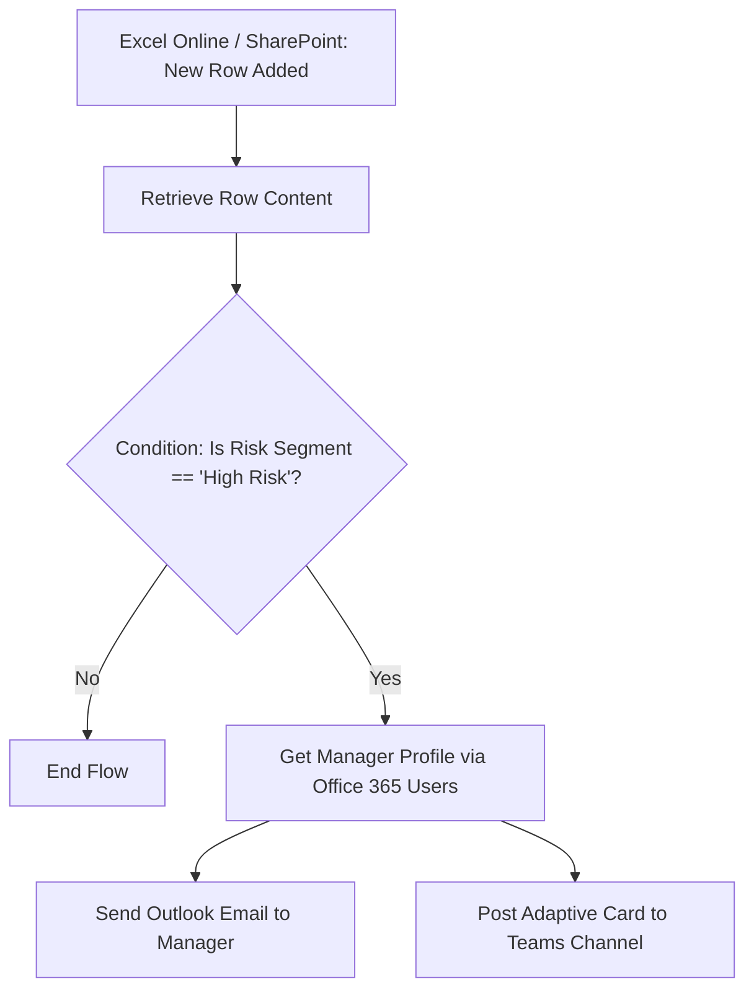

# Power Automate Workflows Configuration Guide

Integrating Power Automate adds powerful transactional actions to your Power BI report, showing recruiters you build *interactive tools*, not just static charts. Follow this blueprint to set up the two automation flows.

---

## Flow 1: High Attrition Risk Alert (Automated Push Notification)

* **Objective**: Automatically alert the HR Director and Department Head via Email and Microsoft Teams when a new survey entry calculates an employee's Risk Segment as "High Risk".
* **Trigger**: A new row added to the employee tracking dataset (hosted on SharePoint Online or OneDrive for Business).

### Step-by-Step Flow Construction



#### 1. Trigger Setup
* **Name**: *When a row is added into a table* (Excel Online) or *When an item is created* (SharePoint).
* **Location**: Point to the folder where your `hr_employee_data` Excel sheet resides on OneDrive or SharePoint.
* **Table**: Select `Fact_Employees` or your data entry backup table.

#### 2. Action: Condition
* Set a condition action:
  * **Value 1**: Choose dynamic content `Risk Segment` (or if you are checking values before Power BI refresh: `Job_Satisfaction` is less than or equal to `2` AND `Overtime` is equal to `Yes`).
  * **Operator**: `is equal to`
  * **Value 2**: `High Risk` (or raw validation triggers).

#### 3. Action: Get User Profile (Office 365 Users)
* Add action **Get manager (V2)**.
* **User (UPN)**: Use the dynamic employee email field or target HR contact dynamic field to dynamically routing alerts.

#### 4. Action: Send Email (Outlook Office 365)
* **To**: Manager Email (dynamic content from previous step) or your own email (for testing).
* **Subject**: `[URGENT] Retention Alert: High Attrition Risk Detected for Employee @{triggerOutputs()?['body/Employee_ID']}`
* **Body** (HTML):
  ```html
  <h3>Retention Risk Warning</h3>
  <p>Our People Analytics model has flagged an employee in your department at risk of resigning.</p>
  <ul>
    <li><strong>Employee ID:</strong> @{triggerOutputs()?['body/Employee_ID']}</li>
    <li><strong>Job Role:</strong> @{triggerOutputs()?['body/Job_Role']}</li>
    <li><strong>Satisfaction Level:</strong> @{triggerOutputs()?['body/Job_Satisfaction']}/5</li>
    <li><strong>Work-Life Balance:</strong> @{triggerOutputs()?['body/Work_Life_Balance']}/5</li>
    <li><strong>Overtime Indicator:</strong> @{triggerOutputs()?['body/Overtime']}</li>
  </ul>
  <p>Please schedule a proactive check-in or 1-on-1 meeting to discuss retention strategies.</p>
  ```

#### 5. Action: Post Adaptive Card (Microsoft Teams)
* **Action**: *Post card in a chat or channel* (Microsoft Teams).
* **Post as**: `Flow bot`
* **Post in**: `Channel`
* **Team & Channel**: Select your general HR or Management channel.
* **Adaptive Card (JSON)**: Paste this code into the Card input:
  ```json
  {
    "type": "AdaptiveCard",
    "body": [
      {
        "type": "TextBlock",
        "size": "Medium",
        "weight": "Bolder",
        "text": "🚨 Retention Attrition Risk Alert",
        "color": "Attention"
      },
      {
        "type": "FactSet",
        "facts": [
          { "title": "Employee ID:", "value": "@{triggerOutputs()?['body/Employee_ID']}" },
          { "title": "Role:", "value": "@{triggerOutputs()?['body/Job_Role']}" },
          { "title": "Department:", "value": "@{triggerOutputs()?['body/Department']}" }
        ]
      },
      {
        "type": "TextBlock",
        "text": "Action Required: This employee's metrics fall within our high-churn profile (low satisfaction + overtime). Set up a retention discussion.",
        "wrap": true
      }
    ],
    "$schema": "http://adaptivecards.io/schemas/adaptive-card.json",
    "version": "1.3"
  }
  ```

---

## Flow 2: Power BI Self-Service Export (Dashboard Trigger)

* **Objective**: Allows HR Managers to click an "Email Me This Page" button directly inside the Power BI Dashboard to receive a PDF export of the current filtered report page.
* **Trigger**: Power BI Button click (using the Power Automate visual).

### Step-by-Step Flow Construction

1. **Insert Power Automate Visual**:
   * In Power BI Desktop, click the **Power Automate for Power BI** visual in the Visualizations pane.
   * Add the columns you want to pass as data (e.g. User Email, Current Date, Selected Department) to the visual fields.
2. **Configure the Flow** (Click `...` on the visual and choose **Edit**):
   * Select **Create a new flow**.
3. **Trigger**: *Power BI button clicked*.
4. **Action 1**: *Export to File for Power BI Reports* (Premium feature, can substitute with OneDrive PDF file retrieval or simply sending report URL if on free tiers).
   * **Workspace**: Select your workspace.
   * **Report**: Select your `HR Analytics Dashboard` report.
   * **Export Format**: `PDF`
5. **Action 2**: *Send an Email (V2)*:
   * **To**: `User Email` (Dynamic content passed from Power BI button clicker).
   * **Subject**: `Requested Report: HR Analytics Executive Summary - @{utcNow('yyyy-MM-dd')}`
   * **Body**: *"Attached is the requested PDF report snapshot with your selected dashboard filters applied."*
   * **Attachments**:
     * **Name**: `HR_Analytics_Export.pdf`
     * **Content**: Use dynamic content `File Content` from the Export action.
6. **Save & Apply**: Save the flow and return to Power BI. Customize the button text on your canvas to say *"Export & Email PDF Dashboard"*.
